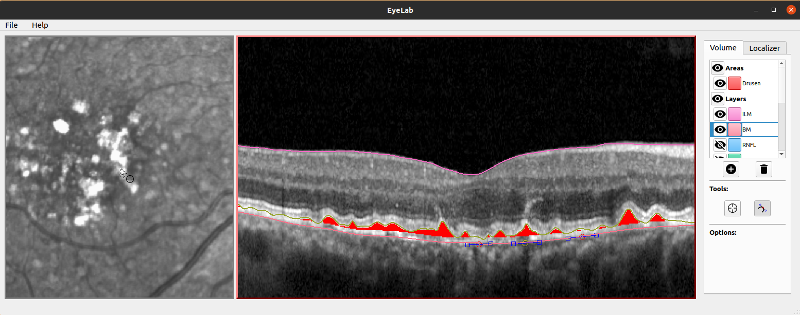

# EyeLab

EyeLab is a multimodal annotation tool for ophthalmological imaging data.



## Getting Started
If you are on Windows, download the latest executable [here](https://github.com/MedVisBonn/eyelab/releases/latest/download/EyeLab-0.1.0.exe) and double click it to start EyeLab.

For Linux there is no package, but you might want to have a look at the Developers section for how to set up EyeLab.

### Importing Data

Use the File Menu on the top left of the EyeLab window to import, save or open data to your workspace.


#### Supported Formats

+ Data exported from HEXEX in the .xml or .vol format
+ Data from the RETOUCH challenge
+ AMD and Control Dataset from  (Farsiu 2014)

You can also import B-scans from a folder (sorting the file names is expected to result in the correct B-scan order)

Annotations can be saved as .eye files, [EyeLabs file format](###-the-.eye-format).


### The Workspace:

Your workspace consists of a combined Enface and Volume view. On the right you have an overview
where annotations are managed for the OCT volume as well as for the Enface image.

### Navigation

You can zoom in and out using the mouse wheel. With the standard **Inspection** tool you can
move the image around if you want to see another part. If you press CTRL while using the mouse
wheel on the Volume view, you scroll through adjacent B-scans. Use CRTL + x to toggle a
linked navigation where B-scans change based on your mouse position in the enface.

## Area Annotations

An area annotation in Eyelab is a pixel_map on top of the underlying image. Its color can
be changed, as well as its visibility.

### Adding a new Area Annotation

Create a new area using the (+) symbol in the overview on the right. Specify a name
and select Areas from the "Type" dropdown.

### Changing Area Annotations

First select the area you want to annotate from the overview on the right. Selecting an
area automatically enables the **Pen** tool. You can now make annotations. The size of the
**Pen** tool can be changed on the right.

If you want to pan around in the image select the **Inspection** tool on the right.

## Layer Annotations

An OCT Layer in Eyelab is combination of explicit layer heights provided per A-scan,
and a cubic spline curve which can be manipulated by adding, removing or moving the
curves knots.

### Adding a new Layer Annotation

Create a new layer using the (+) symbol in the overview on the right. Specify a name
and select Layers from the Type dropdown.

### Changing Layer Annotations

First select the layer you want to annotate from the overview on the right. Selecting a
layer automatically enables the **Curve** tool. You can now start adding control points
of a cubic spline curve, by double click on the desired location. You can move control
points by left click and hold and delete them with a right click.
These control points consist of a red circle the curve has to pass through and two
blue rectangles which control at which angle the curve enters and leaves the red control
point

If you want to pan around in the image select the **Inspection** tool on the right.

The layer heights are constantly updated to represent the position of the current cubic
spline curve.


### The .eye format
.eye files are zip archives of the following structure:
```
file.eye
│   meta.json
│   raw_volume.npy # unprocessed by eyepy
│
└───localizer
│   │   meta.json
│   │   lcoalizer.npy
│   │
│   └───annotations
│       └───pixel
│           │   meta.json
│           │   pixel_maps.npy
│
└───annotations
    └───layers
    │   │   meta.json
    │   │   layer_heights.npy
    │
    └───voxels
        │   meta.json
        │   voxel_maps.npy
```

Since Eyelab builds on the eyepy Python package, annotations stored by Eyelab in the .eye formt can be easily loaded with eyepy:


```python
import eyepy as ep
ev = ep.EyeVolume.load("path/to/file.eye")
```

# Development

Clone the repository, install python poetry and run `poetry install` after navigating into the project folder.

To run EyeLab run `poetry run eyelab/main.py`
## Building the Windows executable

```shell
poetry run pyinstaller eyelab/main.py --name EyeLab --onefile --windowed -i icon.ico
```
